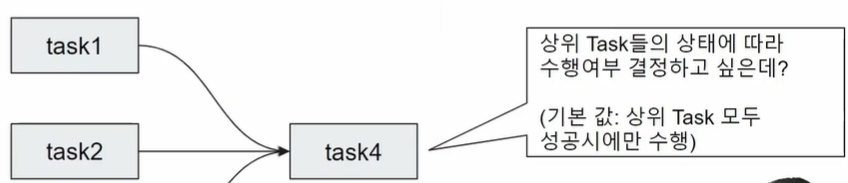

# 강의 : [6] Trigger Rule 설정하기

##  **dags_python_with_trigger_rule_eg1.py**
##  **dags_python_with_trigger_rule_eg2.py**
- Trigger Rule : 하위 Task의 실행하는 조건 
   
- Trigger Rule 종류
- 실습 

##  **dags_python_with_trigger_rule_eg1.py**
 > 실패 유도 
        
##  **dags_python_with_trigger_rule_eg2.py**
 > 

# 강의 : [6] Task groups

## **dags_python_with_task_group.py**
 ## Task Group 
    - [공식문서](https://airflow.apache.org/docs/apache-airflow/stable/core-concepts/dags.html#taskgroups)
    - Task Group 안에 Task Group을 중첩하여 구성 가능 
    1. Task group Decorator 이용 
        - 그룹아이디(group_id='')주고, 함수를 랩핑함. 
        - \``` ``` 덕스트링(docstring)(=> tooltip)으로 함수에 대한 설명을 제공해주는 기법
    2. Task Group 실습(클래스 이용)
        - with TaskGroup (group_id='', tootlip='') as group_nm : ..
    - group 이 다르면 task_id 가 같아도 무방함. 

- docString 이 어떻게 보이게 되는지 확인 
- 

# 강의 : [6] Edge Labels 

## **dags_ .py**

### Edge Label 
- Task 연결에 대한 설명 (선에 대한 설명)
    - 여러 분할에 대한 노드들에 설명이 써져 있음


