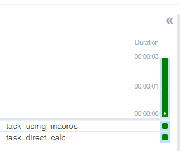

# 강의 : [4.Tempalte Variable] Python Operator에서 macro 변수 사용하기

## 스케줄러 부하를 줄이는 방법

### Web UI  확인 이 얻은 팁

- 긴 막대를 누르면 Jinja Template 변수들에 대해 볼 수 있음. 

--- 

# 강의 : [5.데이터공유] Python Operator에서 Xcom 사용

## Xcom (Cross Communication)
    - Airflow DAG 안 Task 간 데이터 공유를 위해 사용되는 기술
    ex) Task 1의 수행 중 내용이나 결과를 Task2에서 사용 또는 입력으로 주고 싶은 경우. 

    - 주로 작은 규모의 데이터 공유를 위해 사용 (1GB 이상의 데용량 데이터 공유를 위해 외부 솔루션 사용 필요 : AWS S3, HDFS 등.. )

### 활용 방법 
    1) **kwargs 에 존재하는 ti(task_instance) 객체 활용
        - xcom_push(key="[k]", value=[v])
        - xcom_pull(key="[k]") / (key="[k]", task_id='[task_id]')

    2) python 함수의 return 값 활용
        - return 값을 받아서 다음 처리
        (1) return 을 하면 자동으로 저장 + Task 데커레이터사용으로 Task Flow가 정의 
        (2) return 한 Task가 여러개 있을 때, task_ids 를 입력함. 

### 작성 코드 : 
    - 함수 입출력만으로도 순서를 정의해 줌

      

