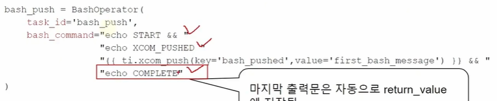

# 강의 : [5.데이터공유] Python Operator에서 Xcom 사용

- git restore --staged dags/__pycache__/*

--- 
---

# 강의 : Bash Operator에서 xcom 사용

## Bash Operator 에서 Xcom 사용 

 -  Bash 같은 경우 출력하는 문장이 return 으로 간주가 됨. 
    -  마지막 출력이 return 값으로 간주됨. 
    - do_xcom_push=False --> 마지막 출력 xcom 에 넣지 말라는 의미

--- 

# 강의 : Python &Bash 오퍼레이터간 Xcom 사용

## 
